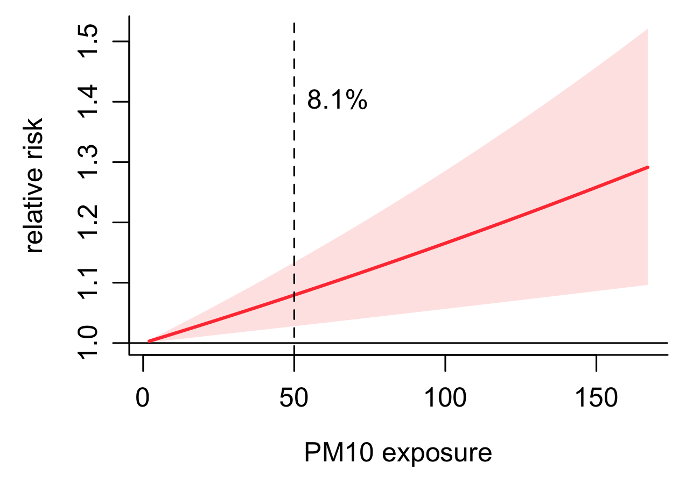
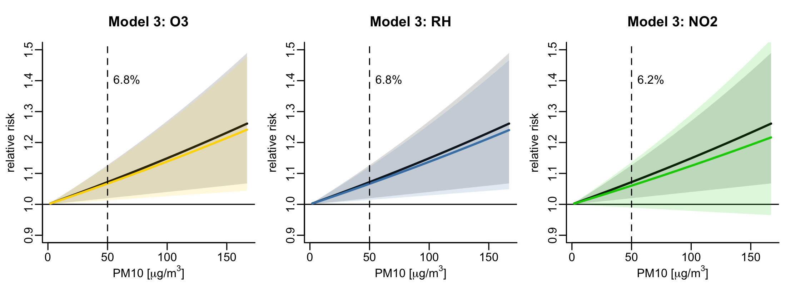
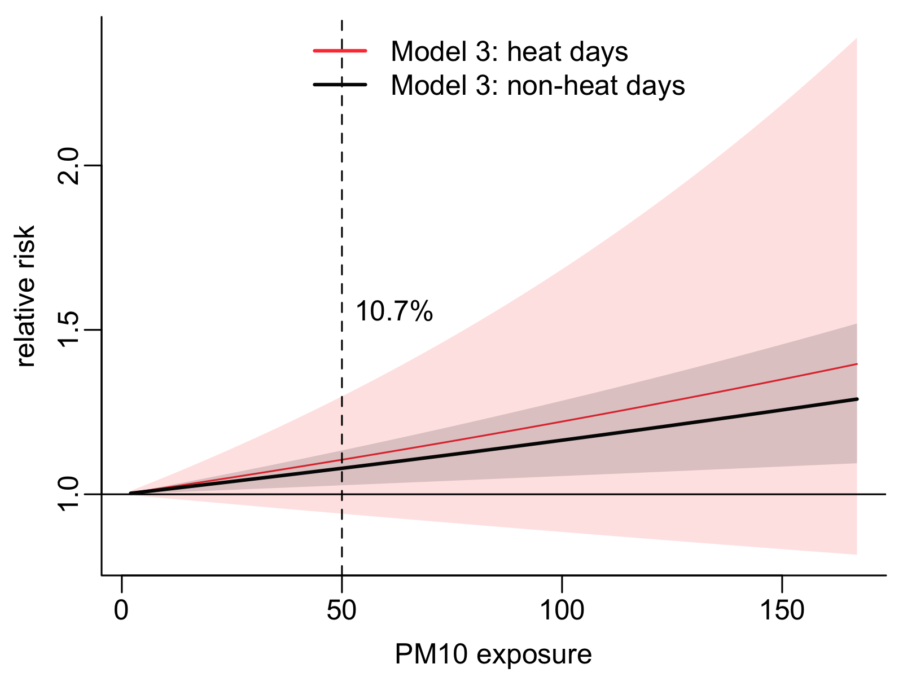

```{r setup, include=FALSE}
knitr::opts_chunk$set(echo = TRUE)

```

## Air pollution and emergency room visits

### 1. Introduction

Over the past decade, research into the health effects of air pollution has grown
rapidly, with increasing evidence linking air pollutants to a range of acute and chronic
health outcomes.

Air pollution - particularly particulate matter such as PM10 (particulate matter with
aerodynamic diameters ≤ 10 μm) - has been identified as a major risk factor for
respiratory diseases, including asthma and chronic obstructive pulmonary disease
(Boogaard et al., 2022). A meta-analysis in 2020 highlighted a substantial increase in
the evidence base compared to previous WHO assessments, showing clear
associations between both PM2.5 and PM10 and increased mortality from
cardiovascular and respiratory diseases, as well as lung cancer.

Short-term exposure to PM10 has been consistently associated with increases in
emergency department visits and hospitalizations, particularly for respiratory and
cardiovascular diseases (Carugno et al., 2018). Studies from countries such as
South Korea, China and Italy have shown that even small increases in PM10 levels -
often as low as 10 μg/m³ - are associated with measurable increases in hospital
admissions. These effects are not evenly distributed across the population:
socio-economic status, age and sex all influence susceptibility. For example, older
adults (Carugno et al., 2016) and women tend to be more susceptible to
pollution-related hospitalizations, while children, particularly school-age boys, are
also at increased risk of respiratory complications.

Evidence also suggests that PM10 may contribute to hospitalizations beyond
respiratory diseases, including cardiovascular (Gouveia et al. 2017) and metabolic
diseases such as diabetes (Miyamura et al., 2022; Chen et al., 2023; Liu et al.,
2023). Long-term exposure may exacerbate these risks. A large cohort study in
Catalonia, Spain, found that people living in areas with high PM10 concentrations had
up to a 50% higher risk of hospitalization for lower respiratory tract infections,
particularly in urban areas (Martínez et al., 2025).


More recently, attention has shifted to how environmental stressors interact. A 2023
meta-analysis of 23 million deaths in 36 countries found that high temperatures can
modify the effect of air pollutants on mortality (Staffogia et al., 2023). This synergistic
relationship suggests that the health burden of PM₁₀ may be increased during heat
waves, particularly among vulnerable groups such as the elderly and those with
chronic diseases.


This study aims to investigate the short-term associations between ambient PM₁₀
concentrations and daily emergency room visits (ERV) in Basel, Switzerland,
over a 19-year period (1995-2013), with a particular focus on how these effects may
vary across demographic groups and in the presence of heat.

<br>

#### 1.1 Study objectives

-	To assess the associations between ERV and ambient PM10 exposure with and without accounting for confounders.

- To investigate whether the presence of heat influences the PM10 ERV association.

- To determine if certain subpopulations are more vulnerable to both associations than others.

We hypothesize that (i) increased PM10 exposure increases emergency room visits in Basel and that (ii) PM10 exposure on heat days leads to higher risk of an ERV compared to non-heat days. Lastly, from all subpopulations (iii) we hypothesize that respiratory disease caused ERV show the strongest association with PM10 in general and on heat days as well as older individuals.

<br>

### 2. Methods

#### 2.1.	Study population and hospitalization data

We collected daily emergency room visits from 1995 to 2013 from Basel which were provided by the University Hospital of Basel (Figure 1). The ERV data was aggregated by sex, age group (<64 years, ≥64 years) and cause (accident; renal; respiratory; cerebrovascular; cardiovascular).

```{r fig1, echo=FALSE, out.width='70%', fig.align='center'}
knitr::include_graphics("plots/X_Basel.png")

```
<center>
**Fig 1:** Map of Basel with both data sources indicated. They are approximately 2.5 km apart.
</center>

<br>

#### 2.2.	Environmental exposure data
Daily measurements of PM10, mean temperature, and other potential confounders like nitrous oxide, ozone, and relative humidity were provided by the meteorological measurement station in Basel-Binningen from the Nationale Beobachtungsnetz für Luftfremdstoffe NABEL operated by the Federal Office for the Environment.

<br>

#### 2.3.	Statistical analysis
We applied a time series analysis to assess the short term effects of PM10 on ERV. We use generalized linear models with a quasi-Poisson regression in combination with distributed lagged non-linear models to account for delayed associations. We control for long-term trends using a natural spline with 8 degrees of freedom per year and for short-term weekly variations using an indicator of the day of the week. We included the potential delayed health effects of PM10 exposure by modeling the daily exposure as a moving average consisting of the current day and the previous day. We accounted for potential confounding from temperature using a cross-basis of daily mean temperature (Liu et al., 2019) with a natural spline with 3 knots at the 10th, 75th, 90th percentile of the temperature distribution for the exposure response, and a natural spline with 3 knots equally log-spaced over 21 lag days for the lag response (Lüthi et al., 2023).

We first investigated the independent association of PM10 and ERV (Model 1) controlled for long-term trends and weekday based variations. In Model 2, we examined the effects of PM10 while controlling for the confounding influence of temperature. We then included additional potential confounders to Model 2 to investigate the impact of nitrous oxide, ozone, and relative humidity on the association using also a 2 day moving average. Lastly, Model 3 differentiates the temperature controlled association of PM10 and ERV into heat and non heat days based on the 90th percentile of the temperature distribution for heat days (Miyamura et al., 2022).

-	Model 1: all ~ PM10_01 + dow + ns(date)

-	Model 2: all ~ PM10_01 + TEMP + dow  + ns(date)

- Model 3: all ~ PM10_01 + TEMP + (PM10_01 * heat_index) + dow + ns(date)

We stratify all models by age, sex, hospitalization cause. We investigate the robustness of our results using sensitivity analysis of the PM10 moving average length, the temperature cross-basis lag period length and the heat percentile thresholds.


### 3.	Results
#### 3.1.	Descriptive statistics 

Table 1 shows the different contributions to ERV of the subpopulations. Females contributed slightly more than males. The majority of the recorded ERV were done by older individuals with 86% of all visits. 53% of the emergency room visits were assigned to the causes that we investigated with the largest contributor being cardiovascular hospitalizations.

<center>
**Tab 1:** Emergency room visits stratified by subpopulations.  
</center>
```{r table1, echo = FALSE, message=FALSE}
hospital_data <- data.frame(
  subpopulation = c("male", "female", "< 64", ">=64",
                    "accident", "renal", "respiratory",
                    "cerebrovascular", "cardiovascular"),
  percentage = c(43.90, 56.10, 13.63, 86.37,
                 2.94, 7.18, 6.84, 5.82, 36.80)
)

hospital_data <- hospital_data |>
  t()

library(kableExtra)
knitr::kable(hospital_data, caption = "") |>
  kable_styling(full_width = FALSE, position = "center")

```

While emergency room visits did not show a strong seasonal cycle with slightly lower values in summer, the temperature and PM10 annual characteristics were opposite of each other (Figure 2). PM10 was highest in winter and lowest in summer, while temperature was highest in summer and lowest in winter. This clear seasonal cycle was also visible in Figure 3. Temperature had an increasing tendency over the observation period while PM10 and emergency room visits showed a decreasing tendency.

```{r fig2, echo=FALSE, out.width='45%', fig.align='center'}


```
<center>
**Fig 2:** Seasonal cycle of temperature, PM10, and emergency room visits.
</center>

<br>

```{r fig3, echo=FALSE, out.width='60%', fig.align='center'}


```
<center>
**Fig 3:** Time series of temperature, PM10, and emergency room visits.
</center>

<br> 

#### 3.2.	PM10 emergency room visit association with and without accounting for temperature confounding

```{r fig4, echo=FALSE, out.width='60%', fig.align='center'}


```
<center>
**Fig 4:** Exposure response for PM10 for all cause emergency room visits from Model 1 (left) and Model 2 (right).
</center>

<br>

Figure 4 (left) shows that in Model 1, PM10 exposure is linearly associated with an increased risk of a non-cause specific emergency room visit. When additionally accounting for temperature confounding in Model 2, the robust linear association of PM10 decreases slightly from a ERV risk at 50 $\mu g/m^3$ PM10 of 7.6% in Model 1 to 7.3% in Model 2. Sensitivity analysis indicates that the inclusion of temperature as a confounder to the model increases the association if the lag period of the temperature crossbasis temperature is limited to 5 days (Supplementary Material Figure S1).


```{r fig5, echo=FALSE, out.width='60%', fig.align='center'}


```
<center>
**Fig 5:** Exposure response for 50 units of PM10 exposure for subpopulations for emergency room visits from Model 2.
</center>

<br>

Comparing the relative risks of the subpopulations in Model 2, we see that for an exposure of 50 PM10, males and females both show very similar relative risks (Figure 5). Older individuals showed both a higher and more robust relative risk at the same exposure compared to younger individuals below the age of 64. From the causes for the emergency room visit, cerebrovascular and cardiovascular cause visits which showed increased risk due to exposure, the latter having the more robust association. The sensitivity analysis of the moving average length of PM10 indicated that the associated relative risk decreases with increasing moving average period for the all cause, sex, and age subgroups (Supplementary Material Figure S2).


Investigating possible other environmental confounders, we found that both ozone and relative humidity both decreased the association only slightly (Supplementary Material Figure S3). The addition of nitrous oxide as a confounder to Model 2 decreased the association more and diminished the previously strong evidence of an association between PM10 and ERV.

<br>

#### 3.3.	Differentiating the PM10 exposure response to heat and non heat days

```{r fig6, echo=FALSE, out.width='60%', fig.align='center'}
knitr::include_graphics("plots/model3_all.png")

```
<center>
**Fig 6:** Exposure response for PM10 on heat and non-heat days  for all-cause emergency room visits from Model 3.
</center>

<br>

Building on Model 2, we distinguished in Model 4 between the association of PM10 and emergency room visits on heat days and non-heat days. As Figure 6 shows, the presence of heat doubles the risk associated with 50 $\mu g/m^3$ PM10 exposure compared to non-heat days. However, utilizing 10% of the data to represent heat, we see that the association is not clear anymore with confidence intervals crossing the 1 line for the heat scenario. When adjusting the heat threshold to the 95th percentile, the association on heat days decreases by 2.5% for an exposure of 50 $\mu g/m^3$ PM10 (Supplementary Material Figure S4). 


```{r fig7, echo=FALSE, out.width='60%', fig.align='center'}


```
<center>
**Fig 7:** Exposure response for PM10 on heat and non-heat days  for subpopulations and emergency room visits from Model 3.
</center>

<br>

We compared the effect of heat on the PM10 association in all subpopulations (Figure 7). While females were not affected by the presence of heat, the relative risk of an ERV in males increased from 7% on non-heat days to 26% on heat days. The heat-related increase was also larger for younger than for older individuals, with very large uncertainties in younger individuals and large uncertainties for older individuals. From all causes, only cerebrovascular caused visits increased due to the presence of heat, while all other causes showed no heat-effect. However, all heat-induced cause-specific changes of the PM10 emergency room association were coupled with very strong uncertainties.

<br>

### 4. Discussion

We investigated the short-term health effects of PM10 exposure and found, as hypothesized, that PM10 exposure represents a health hazard as it has a positive association with emergency room visits, which decreased when accounting for temperature confounding. This indicates that part of the risk associated with PM10 in Model 1 could be attributed to temperature exposure. Specifically, this could be represented by the overlap of the highest PM10 exposure in winter with cold-related temperature effects on the risk of an emergency room visit. Our moving average window of 2 days was further strenghtened by the sensitivity analysis, indicating the short term character of PM10 exposure.

Furthermore, we explored the effects of heat on the PM10 emergency room visits ERV association. We hypothesized that heat exposure would increase the risk for an ERV and found that the presence of heat further exacerbated this risk by almost doubling the risk of an ERV. This implies that environmental stressors can have additive effects concerning the risk of an emergency room visit.

Investigating the subpopulations, we expected respiratory disease emergency room visits to show the strongest response to PM10 exposure, as described in previous studies. We found that, from all subpopulations, the relative risk among both age and sex subgroups was quite similar to the risk in all emergency room visits. However, we saw elevated risks for cerebrovascular and cardiovascular cause visits which are in agreement with latest research. The absence of an association with respiratory cause visits was against expectations and contradicted existing knowledge about the health effects of PM10 exposure. The association of PM10 with renal, accident and respiratory cause visits were inconclusive,  due to low statistical power. The influence of the sample size was also clearly visible comparing younger and older individuals, which contributed to emergency room visits with 15% and 85% respectively. Conclusions about the health effects on older individuals had consistently smaller confidence intervals which could likely be attributed to the difference in data availability.

The presence of heat further increased the risk of an emergency room visit for males and younger individuals, while older individuals experienced less of an increase and females even a decrease in risk. Previous research has established these subpopulations as vulnerable to heat waves, however, our results disagree with existing literature, which report an increased vulnerability to heat in general for females and older individuals. The stratification into heat and non-heat days however lead to small sample sizes across all cause specific subpopulations, preventing meaningful conclusions.

We acknowledge several limitations to our study. Firstly, using emergency room visits of one hospital in Basel limits the generalizability of our findings to the whole population of Basel and Switzerland. Similarly, the selection of this specific Hospital could introduce biases based on its location, catchment area, and specializations etc. Secondly, we assume that our exposure measurements represent the experienced exposure by all individuals admitted to the emergency room. Taking a point measurement as an exposure reference for a whole city is a clear limitation. Thirdly, we do not consider whether admitted individuals stayed in Basel the previous day up to admission and therefore could potentially be exposed to the measured air pollution during our prolonged exposure period. Lastly, our study design limits our conclusions to associations as we cannot infer the etiology of the exposure. 

<br>

### 5. Conclusion

In conlusion, we found PM10 exposure to increase the risk of an emergency room visit, especially in the presence of heat. Specifically vulnerable to this were males and older individuals.


<br>

### References

Carugno, M., Dentali, F., Mathieu, G., Bordini, L., Consonni, D., & Bertazzi, P. A. (2018). PM₁₀ exposure is associated with increased hospitalizations for respiratory syncytial virus bronchiolitis among infants in Lombardy, Italy. Environmental Research, 166, 452–457. https://doi.org/10.1016/j.envres.2018.06.016


Carugno, M., Consonni, D., Randi, G., Catelan, D., Grisotto, L., Bertazzi, P. A., & Biggeri, A. (2016). Air pollution exposure, cause-specific deaths and hospitalizations in a highly polluted Italian region. Environmental Research, 147, 415–424. https://doi.org/10.1016/j.envres.2016.03.003


Gouveia, N., Corrallo, F. P., Leon, A. C. P., Junger, W., & Freitas, C. U. (2017). Air pollution and hospitalizations in the largest Brazilian metropolis. Revista de Saúde Pública, 51, 117. https://doi.org/10.11606/S1518-8787.2017051000223


Miyamura, K., Nawa, N., Nishimura, H., Fushimi, K., & Fujiwara, T. (2022). Association between heat exposure and hospitalization for diabetic ketoacidosis, hyperosmolar hyperglycemic state, and hypoglycemia in Japan. Environment International, 167, 107410. https://doi.org/10.1016/j.envint.2022.107410


Stafoggia, M., Michelozzi, P., Schneider, A., Katsouyanni, K., Samoli, E., Andersen, Z. J., … & Gasparrini, A. (2023). Joint effect of heat and air pollution on mortality in 620 cities of 36 countries. Environment International, 181, 108258. https://doi.org/10.1016/j.envint.2023.108258


Liu, C., Chen, R., Sera, F., Vicedo-Cabrera, A. M., Guo, Y., Tong, S., … & Kan, H. (2019). Ambient particulate air pollution and daily mortality in 652 cities. The New England Journal of Medicine, 381(8), 705–715. https://doi.org/10.1056/nejmoa1817364


Lüthi, S., Fairless, C., Fischer, E. M., Knutson, T. R., & Seneviratne, S. I. (2023). Rapid increase in the risk of heat-related mortality. Nature Communications, 14, 4894. https://doi.org/10.1038/s41467-023-40599-x


Chen, Y., Zhang, Y., Li, J., Wang, Q., & Liu, F. (2023). Short-term effects of ambient PM10 on hospital admissions for type 2 diabetes in Sichuan Province, China. GeoHealth, 7(3), e2023GH000846. https://doi.org/10.1029/2023GH000846 

Kim, H., Park, Y., & Lee, W. (2023). Association between particulate matter and respiratory hospitalizations in South Korea: A nationwide time-series study. Environmental Health Perspectives, 131(2), 027004. https://doi.org/10.1289/isee.2023.OP-203 

Liu, Y., Wang, H., Sun, X., & Zhao, J. (2023). Impact of PM10 on cardiovascular hospital admissions and economic burden in Shanghai, China: A time-series study using medical insurance data. Environmental Sciences Europe, 35(1), 84. https://doi.org/10.1186/s12302-023-00754-z 

Martínez, A., Vicedo-Cabrera, A. M., Basagaña, X., & Ballester, F. (2025). Long-term air pollution exposure and hospital admissions for lower respiratory infections: A prospective cohort study in Catalonia, Spain. The Guardian, April 4, 2025. (Based on article coverage) https://www.theguardian.com/environment/2025/apr/04/pollutionwatch-dirty-air-lower-respiratory-infections

World Health Organization. (2021). WHO global air quality guidelines: Particulate matter (PM2.5 and PM10), ozone, nitrogen dioxide, sulfur dioxide and carbon monoxide. World Health Organization. https://www.who.int/publications/i/item/9789240034228

Wang, T., Zhou, Y., & Liang, L. (2024). Short-term exposure to air pollutants and hospital admissions for respiratory diseases in children: A case-crossover study in Suzhou, China. Journal of Health, Population and Nutrition, 43(1), 12. https://doi.org/10.1186/s41043-024-00683-4)

Xu, Y., Guo, Y., & Tong, S. (2022). Joint effects of heat and air pollution on mortality and morbidity: A systematic review and meta-analysis. Environmental International, 161, 107128. https://doi.org/10.1016/j.envint.2022.107128

Zhang, L., Chen, F., & He, S. (2023). Air pollution and hospital admissions for acute upper respiratory infections in children: A time-series analysis in Lanzhou, China. Pediatric Pulmonology, 58(5), 1301–1309. https://doi.org/10.1002/ppul.26699

Guo, Y., Li, S., Liu, D. L., & Tong, S. (2020). Interactive effects of heatwaves and air pollution on health: Current evidence and future directions. Current Environmental Health Reports, 7, 33–41. https://doi.org/10.1007/s40572-020-00266-6


<br>

### Supplementary Material

```{r sfig1, echo=FALSE, out.width='50%', fig.align='center'}


```
<center>
**Fig S1:** Exposure response for PM10 for all cause emergency room visits from Model 1 (left) and Model 2 (right).
</center>

<br>

```{r sfig2, echo=FALSE, out.width='70%', fig.align='center'}


```
<center>
**Fig S2:** Exposure response for PM10 for all cause emergency room visits from Model 1 (left) and Model 2 (right).
</center>


<br>

```{r sfig3, echo=FALSE, out.width='100%', fig.align='center'}


```
<center>
**Fig S3:** Exposure response for PM10 with different confounders added to Model 2 (left: O2, center: relative humidity, right: NO2) for all emergency room visits.
</center>

<br>

```{r sfig4, echo=FALSE, out.width='50%', fig.align='center'}


```
<center>
**Fig S4:** Exposure response for PM10 on heat and non-heat days  for all-cause emergency room visits from Model 4 with a heat threshold at the 95th percentile of the temperature distribution.
</center>

<br>

```{r sfig5, echo=FALSE, out.width='45%', fig.align='center'}


```
<center>
**Fig S5:** Cummulative relative risk for temperature exposure using the crossbasis of temperature for all cause emergency room visits.
</center>

<br>
